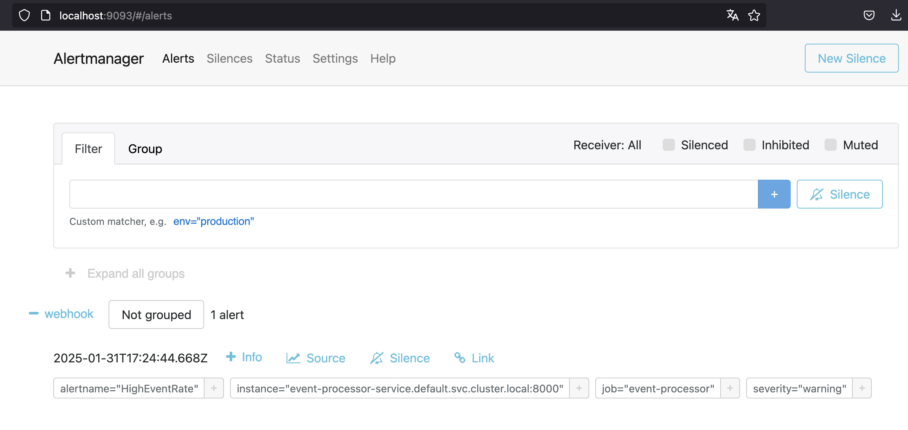

# Alert Workflow & Use Case
## High Event Rate  

  More than **100 events** are received, which can be verified via the `get_events` endpoint of the Event Processor application.  

 

### Prometheus Alert Trigger  
  The following alert rule (defined in `prometheus-deployment.yml`) detects when event processing exceeds 100 events within a short time frame:  

  ```yaml
  - alert: HighEventRate
    expr: events_processed_total > 100
    for: 1m
    labels:
      severity: warning
    annotations:
      summary: "Too many events processed"
      description: "More than 100 events were processed in a short time."
  ```  

  Via **Port-Forwarding**, we can observe the alert in the **Prometheus UI**:  

  ```sh
  kubectl port-forward svc/prometheus-service 9090:9090
  ```

Open: [http://localhost:9090/alerts](http://localhost:9090/alerts)  

 

### Alert Routing via Alertmanager  
- Once triggered, the alert is forwarded by Alertmanager to our webhook.  
- The Alertmanager UI can also be accessed using Port-Forwarding:  

  ```sh
  kubectl port-forward svc/alertmanager-service 9093:9093
  ```

Open: [http://localhost:9093](http://localhost:9093)  

 

### Webhook Handling in FastAPI  
  The alert is sent to the webhook endpoint in our FastAPI Event Processor App. The screenshot below shows the successful forwarding of the alert to our webhook endpoint:  

 

---

## Adding a New Alert Rule  

To define a new alert, edit `prometheus-deployment.yml` and add a rule under the **alerts section**.  

### Example: High Welding Temperature  

```yaml
- alert: HighWeldingTemperature  
  expr: max_over_time(welding_temperature[5m]) > 1500
  for: 1m
  labels:
    severity: critical
  annotations:
    summary: "Dangerously high welding temperature!"
    description: "Welding temperature exceeded 1500°C."
```

### Meaning of the Rule  
- `max_over_time(welding_temperature[5m]) > 1500` → Monitors the highest welding temperature in the last 5 minutes.  
- If the temperature exceeds 1500°C for 1 minute, an alert is triggered.  
- `severity: critical` → Marks the alert as critical, as high temperatures could cause damage.  

---

## Applying Changes  

After adding a new rule, the ConfigMap needs to be updated and Prometheus restarted:  

```sh
kubectl apply -f prometheus-deployment.yml  
kubectl rollout restart deployment prometheus  
```

Then, check the updated rules in Prometheus:  

```sh
kubectl port-forward svc/prometheus-service 9090:9090  
```

Open: [http://localhost:9090/alerts](http://localhost:9090/alerts)  

You should now see the new alert rule active in Prometheus

 
