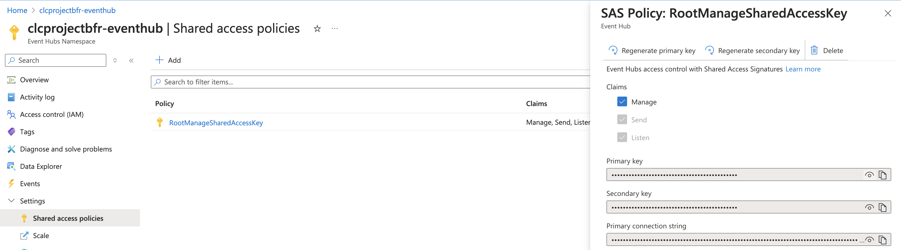
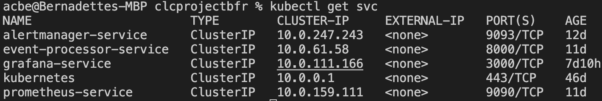
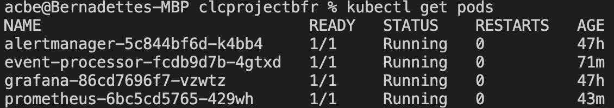

# IoT Monitoring with Prometheus & Grafana
## Goal of the Project

This project focuses on designing a monitoring system for an IoT-based production simulation using cloud technologies. We use a Raspberry Pi device to simulate a manufacturing process, sending data to Azure IoT Hub. The data is then processed by a microservice running in Kubernetes, and the system is monitored using Prometheus and Grafana. This project is part of the lecture Cloud Computing at the University of Applied Sciences Upper Austria. Contributors are: Bernadette Ackerl, Fabian Altendorfer and Regina Gugg.

### High-Level Objectives

- Simulate a production environment using Raspberry Pi devices.
- Integrate IoT devices with Azure IoT Hub.
- Use Prometheus to collect metrics and trigger alerts based on defined thresholds.
- Use Grafana to visualize collected metrics in a dashboard.
- Deploy a microservice in a Kubernetes-based infrastructure on Azure.

## Tech Stack

**Infrastructure & Cloud Services** 

- Azure IoT Hub → Acts as the communication hub for IoT devices, receiving telemetry data.
- Azure Event Hub → Handles streaming of events from IoT Hub and makes them available to consumers.
- Azure Kubernetes Service (AKS) → Hosts and orchestrates our microservice along with monitoring components.

**Microservice Event Processor**

- FastAPI → A lightweight Python web framework used to expose REST endpoints for our demo-project debugging and alert handling.
- Prometheus Client Library → Used to define and expose custom metrics (processed events, unique devices).

**Monitoring & Alerting**

- Prometheus → Collects metrics exposed by the event-processing microservice.
- Alertmanager → Handles alerts when Prometheus detects anomalies (e.g. new IoT device, high rate of processed events).
- Grafana → Connects to Prometheus and visualizes metrics using a dashboard.

**Deployment & Containerization**

- Docker → Used to containerize our FastAPI-based event processor.
- Kubernetes (kubectl & YAML Manifests) → We manually deployed Prometheus, Alertmanager, Grafana, and our event processor using _kubectl apply -f_ and YAML configurations. So we did not use HELM as most of the online tutorials mentioned, we tried to just use yml files :) 

## Demos
- for Alerting, have a look at alert-demo.md
- for Grafana, have a look at grafana-demo.md

## Setup & Installation

0. Prerequisites

    Before starting, ensure you have the following installed:

    - Docker (to build and push the microservice image)
    - kubectl (to manage Kubernetes resources)
    - Azure CLI (to interact with Azure resources)

1. Information
   
    The following steps should guide you through our implementation. We used only yml files to integrate prometheus and grafana with our fastApi (event processor). For simulation/showcase we did not get into more advanced settings, we kept everything in the default namespace and tried to just set those services up and running :)

    The following steps consider the situation that already some IoT-Devices send events to an event-hub and now we want to setup the event-processor application for monitoring those events. 
    
2. Building and Pushing the Microservice Docker Image

    We created a Dockerfile for our event processor app. This Dockerfile needs to be build and pushed to DockerHub using the following commands:

    ```console
    docker build --no-cache --platform linux/amd64 -t <your-dockerhub-username>/event-processor:latest . 
    ``` 

    ```console
    docker push <your-dockerhub-username>/event-processor:latest
    ```

3. Deploying the Microservice to Kubernetes
   
    Before you are able to deploy something your need to setup a cluster in azure:
    1. follow this tutorial: https://github.com/clc3-CloudComputing/clc3-ws24/tree/main/3-Kubernetes/exercise3.1#setup-the-cluster-1 
    2. As soon as your cluster is created, execute the following command in your terminal:
        ```console
        az aks get-credentials --resource-group YOUR-RESOURCE-GROUP --name MYNAME-CLUSTER
        ```
    3. In kubernetes cluster set the event-hub-secret using:
        ```console
        kubectl create secret generic event-hub-secret --from-literal=EVENT_HUB_CONNECTION_STRING="Endpoint=sb://...;SharedAccessKeyName=...;SharedAccessKey=..."
        ```
        you can find the connection string in the namespace, see the follwoing image - copy the primay connection string:  

    We deploy the event processor using _deployment.yaml_

    ```console
    kubectl apply -f deployment.yaml
    ```

    to verify if it worked:

    ```console
    kubectl get pods
    ```

4. Setting Up Prometheus
    Deploy Prometheus using _prometheus-deployment.yml_

    ```console
    kubectl apply -f prometheus-deployment.yml
    ```

    to verify if it worked:

    ```console
    kubectl get pods
    ```

5. Setting Up Alerting with Alertmanager

    Deploy the Alertmanager configuration using:
    ```console
    kubectl apply -f alerts-manager.yml
    ```

    to verify if it worked:

    ```console
    kubectl get pods
    ```

6. Deploying Grafana
    Deploy Grafana using _grafana-deployment.yml_
    ```console
    kubectl apply -f grafana-deployment.yml
    ```

    Verify Grafana is running
    again verify the pods and you can also verify services in general using get svc:

    ```console
    kubectl get pods
    ```

    ```console
    kubectl get svc
    ```

7. Accessing the Services
    If everything went well, then you should see 4 pods and 5 services up and running - as shown in the following images:

     
     


    To view the services in the browser, use port-forwarding:
    ```console
    kubectl port-forward svc/event-processor-service 8000:8000
    ```

    Alert-Manager UI:
    ```console
    kubectl port-forward svc/alertmanager-service 9093:9093
    ```
    Prometheus UI
    ```console
    kubectl port-forward svc/prometheus-service 9090:9090
    ```

    Grafana UI
    ```console
    kubectl port-forward deployment/grafana 3003:3000
    ```

## Overview YML-Files

| File Name                 | Purpose | Key Configuration Areas |
|---------------------------|---------|-------------------------|
| `deployment.yaml`         | Deploys the event processor service on Kubernetes | - Defines the FastAPI container<br>- Sets environment variables for Event Hub connection<br>- Exposes `/metrics` for Prometheus scraping<br>- Defines health probes and debugging/simualtion endpoints |
| `prometheus-deployment.yml` | Deploys Prometheus for monitoring | - Scrapes metrics from `event-processor-service`<br>- Define alerting rules and scraping interval |
| `alerts-manager.yml`       | Configures Alertmanager | - Routes alerts to the `event-processor-service` webhook alert / check if alerts are received at endpoint received_alerts |
| `grafana-deployment.yml` | Deploys Grafana for visualization | - Sets up Grafana container in Kubernetes<br>- Exposes service for dashboard access, log in admin admin at the first time |

> If you need to change how metrics are scraped, update `prometheus-deployment.yml`.  
> If you want to add new alert conditions, modify alerts section in `prometheus-deployment`.  
> For external notifications (e.g., Slack, Email), configure `alerts-manager.yml`. We implemented just a webhook for demonstration.   
> If you want to modify the event processor - for example add a new endpoint, configure `main.py`. Please notice that you need to build and push it to DockerHub and then apply the deployment.yaml again to bring the changes active :)


## Troubleshooting
If something goes wrong, have a look at the pods if they are running and check their logs as well. 

    ```console
    kubectl get pods
    ```

    ```console
    kubectl logs -f <POD-NAME>
    ```

Sometime make sure you have applied the changes correctly and then rollout restart the service helps.

    ```console
    kubectl apply -f <YML-FILE>
    ```

    ```console
    kubectl rollout restart deployment/<DEPLOYMENT-NAME>
    ```


Do not forget to build and push the dockerfile again, if you did change something in the main.py 

    ```console
    docker build --no-cache --platform linux/amd64 -t <your-dockerhub-username>/event-processor:latest . 
    ``` 

    ```console
    docker push <your-dockerhub-username>/event-processor:latest
    ```

    Our event-processor is: bernadetteackerl/event-processor:latest


And if really everything goes wrong, try to stop and start the kubernetes cluster in the azure portal - because if the cache of AKS is blocking you, this helps :) so we learned that patience is needed - a lot :)

## Summary of Research & Lessons Learned
Throughout this project, we relied on various articles and tutorials to guide us. However, most resources used Helm, while we decided to stick to our proposal and implement everything manually with YAML files. This approach made the setup more challenging, requiring extensive debugging and troubleshooting, but ultimately provided us with a deeper understanding of Kubernetes, Prometheus, and Grafana.

Key challenges we faced:

- Debugging FastAPI endpoints and searching through logs to identify issues.
- Manually configuring Prometheus and Alertmanager without Helm.
- Ensuring that alerts were correctly triggered and received via the webhook.

Some references, just to list a few we looked at:
- https://github.com/clc3-CloudComputing/clc3-ws24/tree/main/3-Kubernetes/exercise3.1#setup-the-cluster-1 
- https://devopscube.com/setup-prometheus-monitoring-on-kubernetes/
- https://devopscube.com/alert-manager-kubernetes-guide/
- https://grafana.com/docs/grafana/latest/setup-grafana/installation/kubernetes/
- https://grafana.com/docs/grafana/latest/datasources/
- https://grafana.com/docs/grafana/latest/datasources/prometheus/
- https://prometheus.io/docs/alerting/latest/alertmanager/
- https://home.robusta.dev/blog/prometheus-alerts-using-prometheus-community-helm-chart 
- https://medium.com/@muppedaanvesh/a-hands-on-guide-setting-up-prometheus-and-alertmanager-in-kubernetes-with-custom-alerts-%EF%B8%8F-f9c6d37b27ca 

Despite the challenges, we are proud to present our IoT monitoring demo. Working without Helm required a trial-and-error approach, but it helped us better understand how everything connects.

For future improvements, we would consider:
- Using Helm – to simplify deployments and manage configurations more efficiently.
- Automated Grafana Dashboards – for better visualization and easier dashboard provisioning.
- More Advanced Alerting – once real-world IoT data streams in, we could refine alert definitions.
- Slack or Email Notifications – replacing the webhook with integrations for real-time notifications.

Overall, this project successfully demonstrated how Kubernetes, Prometheus, and Grafana can be used to monitor IoT events in real-time, trigger alerts, and visualize system health.
