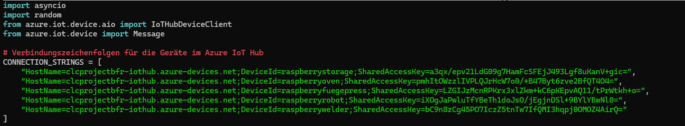
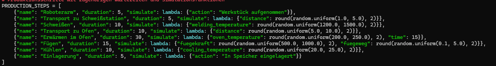
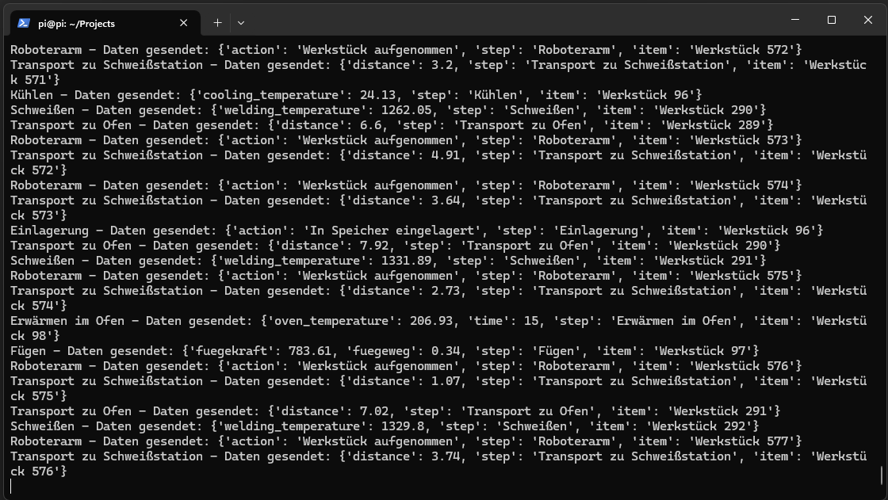

# IoT Setup

This project is based on a simulation of a production line in a manufacturing system. For the simulation, a Python-Script was executed on a Raspberry-Pi.
Following, the background, the setup on the Raspberry-Pi and the setup in Microsoft Azure are described in detail.

## Background
Modern manufacturing processes can be highly complex and thus it is very important to collect detailed data from the individual processes. Usually, the data comes either from the PLC of the workstation/robot (Programmable Logic Controller), Industrial-PC or Sensor of a subcomponent of the workstation, which send their data to the PLC. As there are many different vendors for PLC and Industrial Components, a unified framework is needed to send hierarchically standardized data to the Cloud, where the data is further processed and analyzed. In many cases, this standardized framework is OPC-UA, an open-source industry standard for hosting data models on PLCs and Industrial Subcomponents. In a production environment, OPC-UA-Servers usually send their data to a SCADA-level system, which forwards the data to the Cloud. For this purpose, AWS and MS Azure offer dedicated IoT-Hubs, where developers can connect their IoT-Devices (Google unfortunately doesn't offer these services any longer). This highly interesting usecase gave the authors the idea for this project, where data from IoT-Systems is processed in a Microservice hosted in a Kubernetes Cluster on Microsoft Azure. But as the authors are not in possession of an entire manufacturing system, a simulation must fill this gap.

## Local Setup of the Simulation on Raspberry Pi
For the simulation of the manufacturing system, a Raspberry Pi 3 Model B+ was used to run a Python Script. The use of the Raspberry Pi for that is a relict from the initial stages of this project, as the authors planned to host an entire OPC-UA-Simulation on the small device. However, it became clear rather quickly that this would be a semester-project in itself and so it was decided to build the simulation directly in Python.

The Raspberry Pi was accessed in Powershell via SSH over the Home-Network of the authors. On the Pi, the Python-Script "simulate.py" was placed. This file consists of the following important blocks:

### Connection Strings

In the first part of the script,Imports and Connection Strings are placed for the connection to the Devices in the IoT-Hub. More about the importance of connection strings in the section about the IoT-Hub.

### Production Steps

Next the 

