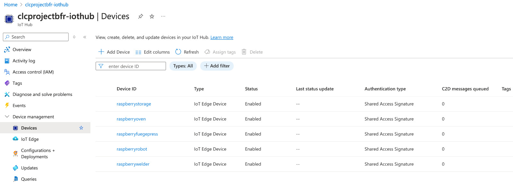

# IoT Setup

This project is based on a simulation of a production line in a manufacturing system. For the simulation, a Python-Script was executed on a Raspberry-Pi.
Following, the background, the setup on the Raspberry-Pi and the setup in Microsoft Azure are described in detail.

## Background
Modern manufacturing processes can be highly complex and thus it is very important to collect detailed data from the individual processes. Usually, the data comes either from the PLC of the workstation/robot (Programmable Logic Controller), Industrial-PC or Sensor of a subcomponent of the workstation, which send their data to the PLC. As there are many different vendors for PLC and Industrial Components, a unified framework is needed to send hierarchically standardized data to the Cloud, where the data is further processed and analyzed. In many cases, this standardized framework is OPC-UA, an open-source industry standard for hosting data models on PLCs and Industrial Subcomponents. In a production environment, OPC-UA-Servers usually send their data to a SCADA-level system, which forwards the data to the Cloud. For this purpose, AWS and MS Azure offer dedicated IoT-Hubs, where developers can connect their IoT-Devices (Google unfortunately doesn't offer these services any longer). This highly interesting usecase gave the authors the idea for this project, where data from IoT-Systems is processed in a Microservice hosted in a Kubernetes Cluster on Microsoft Azure. But as the authors are not in possession of an entire manufacturing system, a simulation must fill this gap.

## Local Setup of the Simulation on Raspberry Pi
For the simulation of the manufacturing system, a Raspberry Pi 3 Model B+ was used to run a Python Script. The use of the Raspberry Pi for that is a relict from the initial stages of this project, as the authors planned to host an entire OPC-UA-Simulation on the small device. However, it became clear rather quickly that this would be a semester-project in itself and so it was decided to build the simulation directly in Python.

The Raspberry Pi was accessed in Powershell via SSH over the Home-Network of the authors. On the Pi, the Python-Script "simulate.py" was placed. This file consists of the following important blocks:

### Connection Strings

In the first part of the script, imports and connection strings are placed for the connection to the Devices in the IoT-Hub. More about the importance of connection strings in the section about the IoT-Hub. Of course those keys shown in the image just demonstrate the useage, for a real life implementation keys should be set via env-variables :) 

### Production Steps

Next a list of dictionaries with lambda functions inside was created for the individual production steps to simulate a small production line. In total, eight production steps were created, including two transport-steps, each with their unique process-behaviour. Each production step can be seen as "workstation" or element of the production process. In modern real-life production systems, the data would come in similar granularity (but of course in much more volume) from the already mentioned OPC-UA Servers. 

### The Simulation
The code is available in file "simulation.py"

#### Async Connection Function
The function connect_device is an asynchronous function responsible for establishing a connection to an IoT Hub device using its connection string. It creates an IoT Hub device client and connects it, returning the client for further usage. This setup is crucial for enabling communication between the simulation and the cloud services.

#### Async Simulate Step Function
The simulate_step function simulates one step of the production process asynchronously. It takes an item from an input queue, simulates the step's action using the lambda function defined in the PRODUCTION_STEPS list, sends the resulting data as a message to the IoT Hub, prints the action taken, waits for the duration specified for the step, and then places the item into the next step's queue if applicable. This function loops indefinitely, allowing for continuous simulation until terminated.

#### Main Simulation Function
The main function orchestrates the entire simulation:

* Device Connections: It starts by connecting to multiple IoT devices using the connection strings provided earlier. These connections are managed asynchronously to handle multiple devices concurrently.
* Queue Setup: Queues are created for each production step to simulate the flow of items through the production process. Each step has an input queue and optionally an output queue.
* Task Creation: For each production step, a task is created using simulate_step. These tasks run concurrently, simulating the parallel nature of production lines.
* Item Initiation: 1000 items are added to the first queue to start the simulation, with a delay between each item to mimic staggered production starts.
* Completion and Cleanup: The simulation waits for all queues to be empty before proceeding to cancel all tasks, ensuring all items have completed their journey through the production steps. Finally, it disconnects from all IoT devices.

This Python script, when run on the Raspberry Pi, provides a detailed simulation of a manufacturing line, where each step's data is sent to Microsoft Azure IoT Hub for further processing or analysis. The asynchronous nature of the code ensures efficient handling of multiple steps and devices, mirroring the complexities of an actual production environment.

### Example
When started, the following output can be observed in the console:

The async function makes it possible that the parts going through the production process can be processed individually per station and that every station can start individually with a new item once the process on the previous item was finished.

## Setup in MS Azure
In order to be able to create the connection strings for the connection to the cloud, an IoT-Hub and devices must be created inside the Microsoft Azure Portal.

### IoT-Hub

The IoT-Hub "clcprojectbfr-iothub" was created in Location Germany West Central. Fortunately, Azure offers extensive free quotas for this service with 8000 daily free messages.

### Devices

Inside IoT-Hub, 5 devices have been created (please note that for the transport-steps in the production systems, no devices are needed because no relevant data is created in these steps).

Each device comes with two unique keys and their individual connection strings:

With the Devices inside the IoT-Hub in place, it is very easy to send data to the cloud. The data from the IoT-Hub is processed in subsequent steps, which are described in detail in the main documentation.

## Main Advantage of this Setup
From an IoT-centered viewpoint, the main advantage of this setup is the flexibility of the proposed solution. In complex modern manufacturing systems, data requirements can change rapidly, driven by issues during the manufacturing process or by quality issues and subsequent customer complaints (and, in the worst case, recalls). With this in mind, management typically demands that data be available in the cloud, ready for analysis if needed, for all devices involved in the manufacturing process, which can amount to several thousand per production line. If connections have to be manually established in the manufacturing plant's connection system for each device individually, it is unrealistic for IoT- and Data engineers to keep pace with business demands, as the manufacturing process is also subject to changes. The proposed solution provides the flexibility needed to achieve business value from day one.

# Summary of Research and Lessons learned
About the connection of IoT-devices with Cloud Platform was written extensively by authors in academia and industry. The project team was able to find a broad range of valuable ressources, consisting of books, blog-articles, github repositories and research papers. First, two books from the German Author Wolfgang Babel were studied in part, to understand relevant IoT-Concepts and Industry standards ([Babel, 2021][2] and [Babel, 2024][3]). From the work of this author, the project team learned about the wide ranging capabilities of the OPC-UA Framework and its application in many different industries. Very relevant for the understanding of the IoT part of our project was the "IoT-Architecture Pyramid", which shows the different layers of IoT-Architecture from start (PLC, in our case the Components of the Simulation) to finish (ERP, in our case Microsoft Azure IoT Hub):

The books from Mr Babel gave us the idea to "jump over" most of the IoT-Layers in the IoT-Architecture Pyramid, as this project is focused on Cloud Computing and not on IoT-Engineering. As outlined by Babel, this can be done using OPC-UA Servers directly from the PLC and thus ignoring most layers in the IoT-Architecture Pyramid:

With this knowledge, the team first planned to install an OPC-UA Server and Simulation on the Raspberry Pi. The connection of OPC-UA Servers with Microsoft Azure Resources to achieve a connected factory was nicely shown by [Krzyczkowski, 2019][1] on his open accessible blog. However, in order to be able to simulate an OPC-UA Server on the Raspberry Pi, a Simulation Server would have been needed on the device. The OPC-Foundation describes in a dedicated [Repository][4] in detail, how to set this up. However, in order to get an OPC-UA Simulation Server up and running, an MQTT broker would have been also needed to setup the PubSub-Architecture:

The setup of this architecture would have been another major challenge for the project team and still not relevant to this lecture, so the team decided to look out for alternatives. At this stage of the research process, the project team focused more on the capabilities of Microsoft Azure in regard to the connection of IoT-Devices. The topic was covered in academia with the integration of OPC-UA Servers ([Forsström and Jennehag, 2017][5]), but the literature review didn't give results for the connection of IoT-Ressources to Azure Ressources directly without the use of OPC-UA Servers and/or MQTT-Brokers. Luckily, the available documentation of Microsoft goes into that in great detail, giving the project team valuable ideas for the realization of the project ([Documentation about IoT-Services][6]). In the documentation we learned about the capabilities of Azure IoT-Hub, device management and the connection of the Event-Hub in Azure to further transport the messages in the pipeline to additional Microsoft Azure Services ([Documentation about Device Management][7], ([Documentation about Messages and Event-Hub in Azure][8]).

In conclusion, while the initial approach was technically ambitious, the pivot to using Azure's native IoT services proved to be a pragmatic decision, aligning well with the project's focus on cloud computing over IoT engineering. This journey not only broadened the technical knowledge of the team but also highlighted the importance of aligning project goals with available resources and practical considerations.

[1]: https://daniel-krzyczkowski.github.io/Connected-Factory-with-Microsoft-IoT-Solutions/
[2]: https://link.springer.com/book/10.1007/978-3-658-34718-5
[3]: https://link.springer.com/book/10.1007/978-3-658-42987-4
[4]: https://github.com/FabianAltendorfer/UA-IIoT-StarterKit?tab=readme-ov-file
[5]: https://ieeexplore.ieee.org/abstract/document/8016265
[6]: https://learn.microsoft.com/en-us/azure/iot/iot-services-and-technologies
[7]: https://learn.microsoft.com/en-us/azure/iot-hub/how-to-device-management?pivots=programming-language-csharp
[8]: https://learn.microsoft.com/en-us/azure/developer/python/quickstarts-messaging-iot

Copyright Disclaimer: All mentioned work was used for research purposes only and accessed via officially licensed channels of the University of Applied Sciences Upper Austria. Please don't use any screenshots from this documentation.
