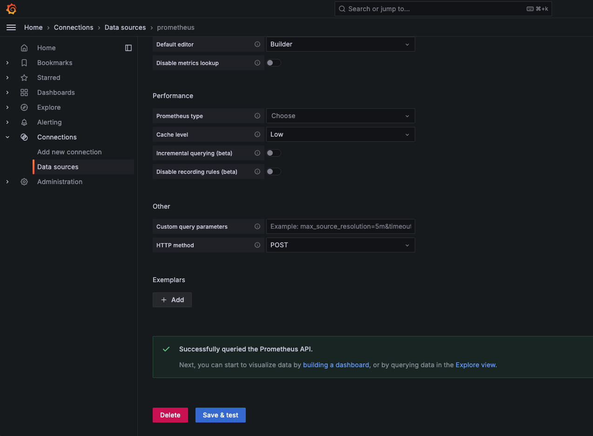
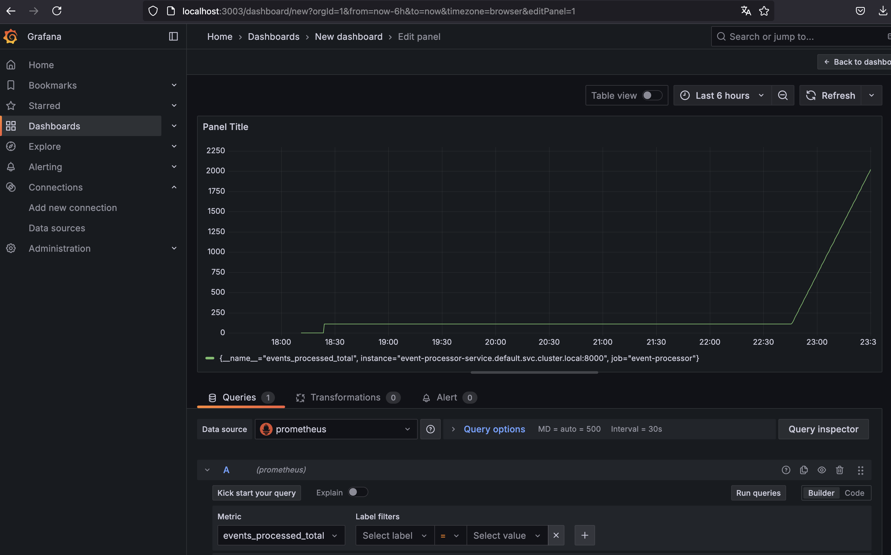
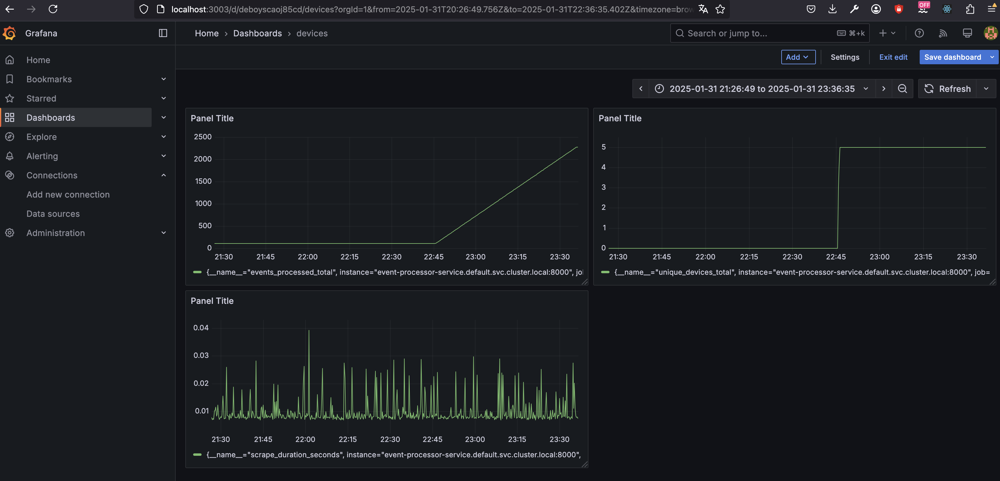

### Grafana Configuration and First Dashboard  

### Deploy Grafana  
In case you haven't already done it as mentioned in the documentation.md :)
Apply the Grafana deployment to your Kubernetes cluster:  

```sh
kubectl apply -f grafana-deployment.yml  
```

Once deployed, check if the pod is running:  

```sh
kubectl get pods  
```

### Access Grafana  

Expose Grafana locally via Port-Forwarding:  

```sh
kubectl port-forward svc/grafana-service 3000:3000  
```

Now open Grafana in your browser:  

[http://localhost:3000](http://localhost:3000)  

**Default login credentials:**  
- **Username:** `admin`  
- **Password:** `admin` (you’ll be prompted to change it on first login)  


### Add Prometheus as a Data Source  

1️. In Grafana, go to **Menu** (click on the icon in the upper left corner)  
2️. Click **Connections**  / **Data Sources** / **Add Data Source**
3️. Select **Prometheus**  
4️. In the **Connection URL field**, enter:  

   ```
   http://prometheus-service.default.svc.cluster.local:9090
   ```

5️. Scroll to the bottom and click **Save & Test**  
-> If successful, Grafana will confirm the connection!  
 


### Create Your First Dashboard  

1️. Navigate to **📊 Dashboards → Create Dashboard**  
2️. Click **"Add visualization"**  and add **Prometheus**
3️. In the **Query section**, select your Prometheus data source  
4️. Enter a query, e.g.:  

   ```
   events_processed_total
   ```

5️. Click **Run queries** → You should now see real-time data!  

 

6. And so on, you can try lots of different metrices, and also the ones we defined for prometheus :) 

Here are some other visualisations we tried:
 
