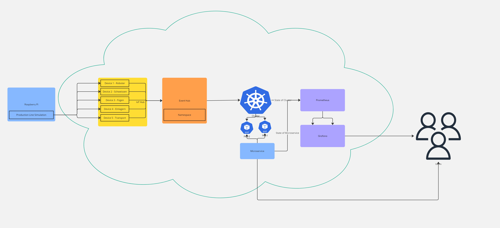

# CLC3 Project Proposal
## Project: Explore Prometheus & Grafana to observe an application
## Goal of the Project
The project aims to design a monitoring system for an IoT-based production simulation using cloud technologies. Therefore, we will use Raspberry Pi device to simulate a manufacturing process. The generated events will be transmitted to Azure IoT Hub, where we deploy a device for each machine of the production simulation. These devices send their event messages to a configured event hub namespace. In order to process the events of this event hub, we will build a microservice hosted in a kubernetes cluster. In order to check if the mircoservice works as planned, we monitor the cluster and the service using Prometheus and Grafana. 

### High Level Goals

- Simulate a production environment using Rasperry Pi device
- Integrate IoT devices with Azure IoT Hub
- Use Prometheus to collect metrics and trigger alerts for defined thresholds
- Use Grafana to visualize collected metrics and logs in a dashboard
- Integrate microservice into a Kubernetes-based infrastructure deployed on Azure

### Development and Existing Components

#### Components to build

- Rasperry Pi based IoT production simulation setup with various devices which send events to Hub
- Integration of Azure IoT Hub with the simulation setup
- Kubernetes Cluster deployment for hosting microservice, Prometheus and Grafana
- Build a mircoservice that processes event data from IoT devices
- Prometheus configuration for collecting system metrics and alerting rules
- Grafana dashboards for log visualization and metrics monitoring
- Part of the project is to try out the in azure managed Prometheus and Grafana instances to evalute if those suit the needs of our project

#### Existing Components

- Prometheus and Grafana (either as managed instances or deployed separately)
- Azure IoT devices and IoT Hub
- Azure Event Hub Namespace
- Azure Kubernetes Service

### High-Level Cloud Architecture
#### Architecture Diagram

## Setup
### Prerequisites
- Azure account with permissions to create and manage resources.
- Azure and Kubernetes CLI (already existing because of lectures)

### Steps
1. **Setup IoT Simulation**
   - configure Raspberry Pi devices to simulate production processes
   - ensure data is sent to Azure IoT Hub

2. **Azure IoT Hub Configuration**
   - create Azure IoT Hub instance
   - register IoT devices and obtain their connection strings
  
3. **Azure Event Hub Configuration**
   - create Azure Event Hub Namespace
   - connect IoT devices to Azure Event Hub

4. **Setup Mircoservice**
   - implement a microservice using python to receive events of Event Hub

5. **Deploy Microservice to Cluster**
   - create kubernestes cluster
   - create Dockerfile, push it to DockerHub, implement deployment.yaml
   - create mircoservice in cluster, export ports on localhost

6. **Prometheus and Grafana**
   - try to integrate Azure managed Prometheus and Grafana to cluster
   - or setup in microservice

7. **Dashboard and Alerts**
   - create Grafana dashboards for metrics and logs visualization
   - define Prometheus alert rules and configure notifications

## Alerting + Notification
To enhance monitoring and simulation for the manufacturing process, two alerting and notification scenarios will be implemented:
1) **New IoT Device Notification:** When a new machine (IoT device) is integrated into the system, a notification will be triggered to inform relevant stakeholders.
2) **Event Volume Alert:** If the system processes for example a threshold of 100 events within a defined period, an alert will be triggered, followed by a corresponding notification.
   
Prometheus will be utilized to monitor these scenarios and trigger alerts. For notification simulation, a webhook will be implemented, sending relevant information as a payload to a predefined URL. This webhook will likely be another endpoint within the microservice.

This approach is chosen to simplify the implementation while providing flexibility for future enhancements. In a production environment, the webhook mechanism could easily be replaced or extended to integrate with an email-sending service or other notification platforms. However, due to the absence of an email server in this context (we don't own such server), a webhook serves as an effective and demonstrative alternative.

## Relation to Cloud Computing
The project is related to cloud computing because it utilizes cloud-based technologies to manage and scale monitoring solutions. By utilizing Azure IoT Hub, the project collects and processes data from IoT devices in the cloud. Azure Kubernetes Service is used for deploying the mircoservice. Additionally, tools like Prometheus and Grafana are hosted in the cloud, providing real-time monitoring and visualization.

## Milestones and responsibilities
| Milestone               | Description                                      | Deadline | Team Member                                      |
|-------------------------|--------------------------------------------------|----------|--------------------------------------------------|
| Setup IoT Simulation    | Configure Raspberry Pi and IoT Hub              | 28.12.2024   | Fabian Altendorfer |
| Azure IoT Hub + Event Hub Configuration    | Configure IoT Hub              | 28.12.2024   | Fabian Altendorfer |
| Setup microservice    | Implement a python microservice with all needed endpoints              | 05.01.2025   |Bernadette Ackerl|
| Setup kubernetes cluster    | Configure cluster              | 05.01.2025   |Bernadette Ackerl |
| Deploy microservice    | Move mircoservice into cluster           | 05.01.2025   |Bernadette Ackerl|
| Integrate Prometheus    | Configure Prometheus, implement alerts | 15.01.2025   |Regina Gugg |
| Build Dashboards        | Configure Grafana and create dashboards for visualization     | 15.01.2025   |Regina Gugg|
| Test and Finalize       | Test alerts and prepare the demo + presentation                | 20.01.2025   |All members|

